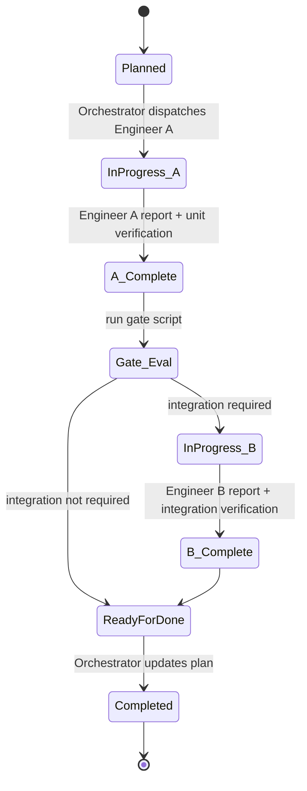

# Local Copilot Workflow: Deterministic Integration and Phase-End E2E

This guide describes how to run a deterministic testing workflow on a developer machine while using GitHub Copilot agents, even though model outputs are probabilistic.

It is designed for this repository's staged model:

- `work-planner` owns slice definitions and acceptance checks.
- `Orchestrator` routes slices and updates status.
- `Engineer` implements within a narrow brief.

The key idea is simple: make policy and gating deterministic outside the model, then let agents operate inside those guardrails.

## Why This Workflow

You want all of the following at once:

1. Fast slice delivery using TDD and small diffs.
2. Integration confidence for boundary changes (network, database, filesystem, queues, external APIs).
3. End-to-end validation at phase end, when full workflows and interfaces are complete.
4. Predictable token usage, generally below 150K per Engineer run.

This workflow gives that by using two implementation passes only when required:

1. Pass A: behavior plus unit tests.
2. Pass B: integration tests only, triggered by deterministic rules.

E2E stays phase-end.

## Determinism Strategy

Do not try to make the LLM deterministic. Make the system deterministic around it.

Determinism comes from:

1. Machine-checkable inputs.
2. Rule-based gates.
3. Structured reports.
4. Scripted verification commands.
5. Hook-enforced policy before commit/push.

If rules and scripts are fixed, the same diff produces the same gate decision regardless of model variability.

## Slice State Machine

Use this state machine for every planned slice.



## Gate Rules (Deterministic)

A slice requires Pass B when any changed file indicates boundary behavior changed.

Required trigger categories:

1. HTTP client/server handlers.
2. Database repositories/migrations/query layers.
3. Filesystem read/write paths.
4. Queue/pub-sub producers or consumers.
5. External API adapters/SDK wrappers.
6. Serialization or protocol boundaries with downstream dependencies.

Recommended safety rule:

- If classification is uncertain, require Pass B.

## Orchestrator Behavior Contract

`Orchestrator` should follow a fixed decision table.

1. Run Pass A via `Engineer` using slice scope from `work-planner`.
2. Require a structured Engineer A report.
3. Execute gate script on repo diff plus Engineer A report.
4. If gate says required, dispatch Pass B to `Engineer` with integration-only scope.
5. Block completion until required verifications pass.
6. Update main plan status only after gate-required work is complete.

`Orchestrator` remains a router. It does not invent product behavior, and it does not skip gate outputs.

## Engineer A and B Scope

Engineer A scope:

1. Implement behavior change.
2. Add/update unit tests.
3. Return structured handoff report.
4. Run unit verification command from slice.

Engineer B scope:

1. Add/update integration tests only for changed boundaries.
2. Make minimal harness/fixture changes needed for those tests.
3. Run integration verification command(s) from slice.
4. Return structured verification report.

If integration failures require behavior changes, open a short follow-up pass back to Engineer A. Do not let Engineer B absorb broad feature refactors.

## Token Budget Policy

Target limits:

1. Normal Engineer run target: 90K to 120K.
2. Warning threshold: 130K.
3. Split required threshold: 150K, unless no safe seam exists.

Split triggers:

1. Boundary changes across multiple subsystems.
2. Large fixture setup or complex integration harness changes.
3. Prompt payload exceeds threshold with full context.

Context discipline for each pass:

1. Include only active slice file and active phase invariants.
2. Include only changed module context needed for that pass.
3. Exclude unrelated architecture docs from Pass B unless directly needed.

## Required Artifacts

Create these repository artifacts to make the workflow operational and repeatable.

### 1) Policy and Decision Artifacts

1. `docs/policies/testing-split-policy.md`
2. `docs/policies/integration-gate-rules.md`
3. `docs/policies/token-budget-policy.md`
4. `docs/policies/e2e-phase-end-policy.md`

Purpose:

- Human-readable source of truth for trigger rules, split rules, and completion rules.

### 2) Structured Report Schemas

1. `schemas/engineer-a-report.schema.json`
2. `schemas/engineer-b-report.schema.json`
3. `templates/engineer-a-report.template.json`
4. `templates/engineer-b-report.template.json`

Purpose:

- Guarantees Orchestrator consumes stable fields instead of free-form prose.

Minimum fields for Engineer A report:

1. `sliceId`
2. `changedFiles`
3. `boundaryChanges`
4. `unitVerificationCommand`
5. `unitVerificationResult`
6. `integrationTargetsSuggested`
7. `risks`

Minimum fields for Engineer B report:

1. `sliceId`
2. `integrationTestsChanged`
3. `harnessChanges`
4. `integrationVerificationCommands`
5. `integrationVerificationResult`
6. `remainingRisks`

### 3) Deterministic Scripts

Create scripts under `scripts/agent/`.

1. `scripts/agent/classify-boundaries.sh`
2. `scripts/agent/evaluate-integration-gate.sh`
3. `scripts/agent/validate-report.sh`
4. `scripts/agent/run-unit-verification.sh`
5. `scripts/agent/run-integration-verification.sh`
6. `scripts/agent/run-phase-e2e.sh`
7. `scripts/agent/enforce-token-budget.sh`

Purpose by script:

1. `classify-boundaries.sh`: classify changed files into boundary categories.
2. `evaluate-integration-gate.sh`: deterministic required or not required output.
3. `validate-report.sh`: schema validation for Engineer reports.
4. `run-unit-verification.sh`: canonical local unit verification wrapper.
5. `run-integration-verification.sh`: canonical local integration wrapper.
6. `run-phase-e2e.sh`: phase-final E2E wrapper.
7. `enforce-token-budget.sh`: fail or warn when prompt payload estimate breaches thresholds.

### 4) Hook Artifacts

Use local Git hooks for enforcement on developer machines.

1. `.githooks/pre-commit`
2. `.githooks/pre-push`
3. `scripts/setup-hooks.sh`

Hook responsibilities:

- `pre-commit`: validate reports and gate decisions for changed slice artifacts.
- `pre-push`: run required verifications for touched slices and block if missing.

Note: Copilot agent lifecycle hooks are not required for determinism. If available in your setup, treat them as optional convenience wrappers that still call these repository scripts.

### 5) Task Runner Artifacts

1. `Makefile` or `justfile` targets.
2. `.vscode/tasks.json` for local one-click execution.

Recommended task names:

1. `slice:pass-a`
2. `slice:gate`
3. `slice:pass-b`
4. `slice:verify`
5. `phase:e2e`

## Suggested Local Commands

The exact commands depend on stack, but the interface should stay stable:

```bash
./scripts/agent/run-unit-verification.sh --slice docs/plans/phases/phase-02/slice-03-foo.md
./scripts/agent/evaluate-integration-gate.sh --diff-base phase-start --report out/engineer-a-report.json
./scripts/agent/run-integration-verification.sh --slice docs/plans/phases/phase-02/slice-03-foo.md
./scripts/agent/run-phase-e2e.sh --phase docs/plans/phases/phase-02/phase.md
```

## Deterministic Gate Output Format

Make gate scripts print machine-readable JSON:

```json
{
  "sliceId": "phase-02/slice-03",
  "integrationRequired": true,
  "reasons": [
    "db_repository_changed",
    "http_adapter_changed"
  ],
  "targets": [
    "OrderRepository",
    "CheckoutApiClient"
  ]
}
```

`Orchestrator` should consume this file and branch automatically.

## Workflow Walkthrough

### Step 1: Planner produces a slice

`work-planner` defines:

1. Outcome.
2. Scope.
3. Unit verification command.
4. Integration verification command placeholder, if boundary touch is likely.
5. Acceptance checks.

### Step 2: Orchestrator dispatches Pass A

Inputs sent to Engineer A:

1. Slice doc.
2. Active phase invariants.
3. Scope boundaries.
4. Unit verification command.

Outputs required:

1. Code and unit tests.
2. Engineer A structured report.
3. Verification evidence.

### Step 3: Gate evaluation

Orchestrator runs:

1. Report schema validation.
2. Boundary classifier.
3. Integration gate script.

Results:

1. `integrationRequired = false` then advance toward completion.
2. `integrationRequired = true` then dispatch Pass B.

### Step 4: Orchestrator dispatches Pass B when required

Inputs sent to Engineer B:

1. Engineer A report.
2. Gate output with specific targets.
3. Narrow integration-only scope.
4. Integration verification command(s).

Outputs required:

1. Integration test changes.
2. Minimal harness updates.
3. Engineer B structured report.
4. Verification evidence.

### Step 5: Complete slice

`Orchestrator` updates status to completed only when required verifications are green.

### Step 6: Phase-final E2E

At each phase end:

1. Run dedicated E2E slice.
2. Run mutation-testing phase-final command if configured by adapter protocol.
3. Record outcomes in plan artifacts.

## Hooks and Copilot Practicalities

On developer machines, prefer repository hooks and scripts over chat-only conventions.

Why:

1. Hooks are deterministic and executable.
2. Scripts can be versioned and reviewed.
3. Agent behavior can vary; script results should not.

Recommended model:

1. Agent prompts request behavior.
2. Hooks and scripts enforce behavior.
3. Plan artifacts record behavior.

## Failure Modes and Guardrails

Common failure modes:

1. Integration scope creep into E2E scenarios.
2. Engineer B making broad feature refactors.
3. Orchestrator overriding gate output informally.
4. Token overrun due to oversized context packets.

Guardrails:

1. Gate output is authoritative.
2. Pass B prompt template is fixed and narrow.
3. Token budget script runs before dispatch.
4. Hook blocks commit when required reports/verifications are missing.

## Minimal Rollout Plan

1. Add policy docs and report schemas.
2. Add gate and validation scripts.
3. Add local hooks and setup script.
4. Run in measure-only mode for one phase.
5. Review false positives and adjust gate rules.
6. Switch to blocking mode after one stable phase.

## Acceptance Criteria For This Operating Model

You can consider this workflow established when all are true:

1. Every completed slice has an Engineer A report.
2. Every boundary-touching slice has either:
   - a gate output explicitly saying integration not required, or
   - a completed Engineer B report with passing integration verification.
3. Every phase has a dedicated final E2E slice.
4. Hooks block missing required artifacts locally.
5. Engineer runs usually stay below 150K token usage.

## What This Does Not Do

1. It does not force integration tests on non-boundary slices.
2. It does not move E2E into every slice.
3. It does not guarantee zero flakiness; it reduces late discovery and enforces consistency.
4. It does not replace `work-planner` ownership of slice definitions.

## Summary

For local Copilot-first execution, the strongest pattern is:

1. Keep E2E at phase end.
2. Add deterministic integration gating for boundary-changing slices.
3. Use two Engineer passes only when the gate requires it.
4. Enforce policy with repository scripts and hooks, not model behavior alone.
