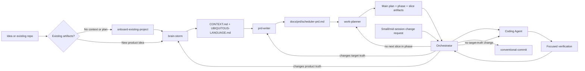

# AI Workflows

Reusable VS Code skills and custom agents for taking software work from an unclear idea to a verified implementation.

The repository separates decisions by ownership:

- **Product truth**: `brain-storm` defines the problem, users, workflow, scope, and vocabulary.
- **Target truth**: `prd-writer` defines what the finished v1 must do and the constraints it must satisfy.
- **Current-state truth**: `work-planner` records the implementation gap, sequencing, statuses, and execution-ready slices.
- **Implementation**: `Orchestrator` dispatches approved slices to `Coding Agent`.
- **Behavior verification**: `tdd-csharp` supplies the Red-Green-Refactor rules for C# work.
- **Repository guidance**: `agent-instructions` maintains durable `AGENTS.md` instructions.
- **Change journal**: `conventional-commit` creates coherent Conventional Commits.

## Quick Start

### New idea

1. Run `/brain-storm` and answer its focused product questions.
2. Confirm the resulting `CONTEXT.md` and `UBIQUITOUS-LANGUAGE.md`.
3. Run `/prd-writer` to create or update the target PRD.
4. Run `/work-planner` to create the implementation plan and active slices.
5. Ask `Orchestrator` to run the next slice.
6. Let `Coding Agent` implement and verify the dispatched slice.
7. Repeat the orchestrator loop until the plan is complete.
8. Run `/conventional-commit` to journal each coherent change.

### Small or mid-session change

Stay in `Orchestrator` and describe the change. It dispatches directly if the change carries no target-truth impact, or tells you which of `prd-writer`, `work-planner`, or `brain-storm` to run first if it does (or if the tier is ambiguous). See the tiering table in [docs/workflow.md](docs/workflow.md).

### Existing codebase without planning artifacts

Run `/onboard-existing-project`. It performs repository discovery and sequences the owning skills. It does not replace their interviews or write their artifacts directly.

### C# behavior change

Use `/tdd-csharp` before implementation. Load its required references, write a failing xUnit test first, make the smallest change that passes, refactor only after green, and finish with the full `dotnet test` suite.

### Resuming after a lost session

Cheapest first: run `git status`/`git diff` for any uncommitted work, then ask `Orchestrator` to continue — it reads only the main plan, active phase, and next slice. Only fall back to general chat exploration if no plan exists yet; it has no contract telling it where to look and is the most expensive option. See [docs/workflow.md](docs/workflow.md#resuming-after-context-loss).

## Workflow At A Glance



The detailed handoffs, gates, and escalation rules are in [docs/workflow.md](docs/workflow.md).

## Documentation Map

- [Workflow and handoffs](docs/workflow.md): how skills and agents cooperate, including stop and escalation rules.
- [Skills catalog](docs/skills.md): purpose, inputs, outputs, and when to invoke each skill.
- [Workflow audit](.github/skills/workflow-audit/SKILL.md): on-demand review of token waste, contract drift, and artifact churn.
- [Agents catalog](docs/agents.md): responsibilities, tools, dispatch boundaries, and reporting.
- [Artifacts and lifecycle](docs/artifacts.md): canonical files, ownership, status rules, and links between artifacts.
- [Extending the system](docs/extending.md): how to add or revise a skill, agent, or reference without breaking the operating model.

## Repository Layout

```text
.github/
  agents/                         Custom agent definitions
  skills/                         User-invocable skills and references
    <skill>/SKILL.md              Skill contract and workflow
    <skill>/references/           Format and domain references
    <skill>/docs/                 Skill-specific supporting docs
docs/                             Documentation for this workflow system
```

## Design Principles

- Keep each durable artifact owned by one skill or agent.
- Treat context and the PRD as upstream, stable truth; put implementation status in plans.
- Keep the main plan as the routing table and single status record.
- Dispatch one vertical slice at a time with explicit scope, verification, and acceptance checks.
- Optimize each cycle for signal: load authoritative context once, pass only the slice payload needed for execution, and report compact outcomes.
- Treat handoff briefs and chat reports as disposable: never echo durable artifact content or create a second status record.
- Minimize artifact churn: update only the owning artifact and the smallest changed field or status; do not copy durable content between artifacts.
- Prefer evidence and explicit escalation over guessed intent.
- Keep changes surgical and report how they were verified.

## Current Repository Scope

This repository contains workflow definitions and documentation. It does not prescribe a product domain, application stack, or build command. Project-specific commands and architecture belong in the target repository's `AGENTS.md`, not in these generic workflow documents.