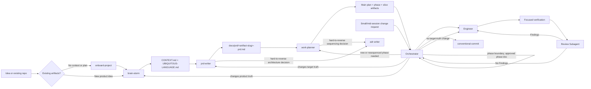

# AI Workflows

Reusable VS Code skills and custom agents for taking software work from an unclear idea to a verified implementation.

The repository separates decisions by ownership:

- **Product truth**: `brain-storm` defines the problem, users, workflow, scope, and vocabulary.
- **Target truth**: `prd-writer` defines what the finished v1 must do and the constraints it must satisfy.
- **Current-state truth**: `work-planner` records the implementation gap, sequencing, statuses, and execution-ready slices.
- **Implementation**: `Orchestrator` dispatches approved slices to `Engineer`.
- **Behavior verification**: `tdd` supplies stack-agnostic, test-level-agnostic Red-Green-Refactor rules and adapts to the repository's own testing packages.
- **Code style**: `code-style/protocol.md` defines stack-agnostic enforcement; `dotnet-editorconfig` is the C#/.NET adapter.
- **Mutation testing**: `mutation-testing` is opt-in and tool-agnostic; the user chooses the tool, cadence, and thresholds.
- **Repository guidance**: `agent-instructions` maintains durable `AGENTS.md` instructions.
- **Change journal**: `conventional-commit` creates coherent Conventional Commits.
- **Decision record**: `adr-writer` records a hard-to-reverse, surprising, trade-off-driven technical decision, gated from within `prd-writer` and `work-planner`.

## Quick Start

### New idea

1. Run `/brain-storm` or select the active `Brain Storm` agent, then answer its focused product questions.
2. Confirm the resulting `CONTEXT.md` and `UBIQUITOUS-LANGUAGE.md`.
3. Run `/prd-writer` or select the active `PRD Writer` agent to create or update the target PRD. It hands off to `adr-writer` when a settled target-architecture choice is hard to reverse, surprising, and a real trade-off.
4. Run `/work-planner` or select the active `Work Planner` agent to create the implementation plan and active slices. It applies the same `adr-writer` gate to sequencing/implementation-architecture decisions.
5. Ask `Orchestrator` to run the next slice.
6. Let `Engineer` implement and verify the dispatched slice.
7. Repeat the orchestrator loop until the plan is complete. At a phase boundary it expands the next phase's slices from its approved phase document and asks you to confirm before continuing.
8. Run `/conventional-commit` to journal each coherent change.

### Small or mid-session change

Stay in `Orchestrator` and describe the change. It dispatches directly if the change carries no target-truth impact, or tells you which of `prd-writer`, `work-planner`, or `brain-storm` to run first if it does (or if the tier is ambiguous). See the tiering table in [docs/workflow.md](docs/workflow.md).

### Any repository not already in the loop

Run `/onboard-project`. It detects whether the repo is empty, a bare scaffold, or a mature codebase, plus which artifacts exist and which stack and test stack are in use, then sequences the owning skills in the right order for that state. It does not replace their interviews or write their artifacts directly.

### Any behavior change

Use `/tdd`. It first settles the repository's test framework, assertion style, test-double approach, and focused/full-suite commands from the existing tests and manifests — asking you when nothing settles it — then runs Red-Green-Refactor against that stack. It never introduces or swaps a testing package on its own, so the packages stay your choice.

For a new scaffold with no tests, run `/tdd` in **stack-settlement mode** before planning the first behavior slice. It records no placeholder code: it returns the chosen framework, assertions, test-double approach, placement, and commands for `/agent-instructions`. The first behavior slice then creates only the test setup needed by its first failing test.

### C#/.NET code style setup

Normally dispatched by `/onboard-project`, which knows when to run it and at what severity. To run it directly: `/dotnet-editorconfig`, answering `baseline` for industry defaults or `walkthrough` to choose rules group by group. It writes the root `.editorconfig` and `Directory.Build.props`, then verifies with `dotnet build` and `dotnet format --verify-no-changes`. Projects added later inherit both files by directory position. It finishes by giving you the exact text to pass to `/agent-instructions` — run that follow-up, or agents will keep overriding the shared settings in new `.csproj` files.

### Mutation testing setup

Opt-in and tool-agnostic. Run `/mutation-testing` when you want it. It asks which project to measure, what run time is acceptable, and which tool you want — presenting realistic candidates for your ecosystem rather than picking one — then runs a guided walkthrough to propose thresholds and writes that tool's root config scoped to unit tests only. The first cycle is measure-only; blocking is a deliberate later step once the survivor backlog clears. Nothing adds a mutation run to a verification command until you enable it.

### Resuming after a lost session

Cheapest first: run `git status`/`git diff` for any uncommitted work, then ask `Orchestrator` to continue — it reads only the main plan, active phase, and next slice. Only fall back to general chat exploration if no plan exists yet; it has no contract telling it where to look and is the most expensive option. See [docs/workflow.md](docs/workflow.md#resuming-after-context-loss).

## Workflow At A Glance



The detailed handoffs, gates, and escalation rules are in [docs/workflow.md](docs/workflow.md).

## Documentation Map

- [Workflow and handoffs](docs/workflow.md): how skills and agents cooperate, including stop and escalation rules.
- [Skills catalog](docs/skills.md): purpose, inputs, outputs, and when to invoke each skill.
- [Workflow audit](.github/skills/workflow-audit/SKILL.md): on-demand review of token waste, contract drift, and artifact churn.
- [Agents catalog](docs/agents.md): responsibilities, tools, dispatch boundaries, and reporting.
- [Artifacts and lifecycle](docs/artifacts.md): canonical files, ownership, status rules, and links between artifacts.
- [Extending the system](docs/extending.md): how to add or revise a skill, agent, or reference without breaking the operating model.

## Repository Layout

```text
.github/
  agents/                         Custom agent definitions
  hooks/                          Operational hook routing for repository automation
  review-gate/                    Operational Review Gate package
    runtime/                      JavaScript runtime, rules, and hook entry points
    rules/                        Active repository rules adopted through review decisions
  skills/                         User-invocable skills and references
    <skill>/SKILL.md              Skill contract and workflow
    <skill>/references/           Format and domain references

docs/                             Documentation for this workflow system

test/
  review-gate/                    External validation suite for Review Gate behavior
```

## Design Principles

- Keep each durable artifact owned by one skill or agent.
- Treat context and the PRD as upstream, stable truth; put implementation status in plans.
- Keep the main plan as the routing table and single status record.
- Dispatch one vertical slice at a time with explicit scope, verification, and acceptance checks.
- Optimize each cycle for signal: load authoritative context once, pass only the slice payload needed for execution, and report compact outcomes.
- Treat handoff briefs and chat reports as disposable: never echo durable artifact content or create a second status record.
- Minimize artifact churn: update only the owning artifact and the smallest changed field or status; do not copy durable content between artifacts.
- Prefer evidence and explicit escalation over guessed intent.
- Keep changes surgical and report how they were verified.

## Current Repository Scope

This repository contains workflow definitions and documentation. It does not prescribe a product domain, application stack, or build command. Project-specific commands and architecture belong in the target repository's `AGENTS.md`, not in these generic workflow documents.
