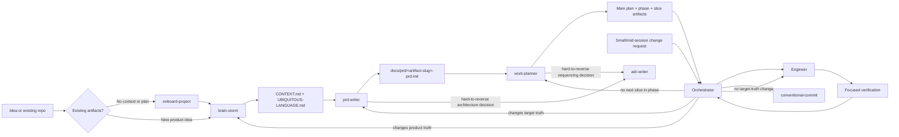

# AI Workflows

Reusable VS Code skills and custom agents for taking software work from an unclear idea to a verified implementation.

The repository separates decisions by ownership:

- **Product truth**: `brain-storm` defines the problem, users, workflow, scope, and vocabulary.
- **Target truth**: `prd-writer` defines what the finished v1 must do and the constraints it must satisfy.
- **Current-state truth**: `work-planner` records the implementation gap, sequencing, statuses, and execution-ready slices.
- **Implementation**: `Orchestrator` dispatches approved slices to `Engineer`.
- **Behavior verification**: `tdd-csharp` supplies the Red-Green-Refactor rules for C# work.
- **Code style**: `code-style/protocol.md` defines stack-agnostic enforcement; `dotnet-editorconfig` and `ts-eslint` are the C#/.NET and TypeScript/Node adapters.
- **Mutation testing**: `mutation-testing/protocol.md` defines stack-agnostic cadence and scope; `stryker-dotnet` and `stryker-js` are the C#/.NET and TypeScript/JavaScript adapters.
- **Repository guidance**: `agent-instructions` maintains durable `AGENTS.md` instructions.
- **Change journal**: `conventional-commit` creates coherent Conventional Commits.
- **Decision record**: `adr-writer` records a hard-to-reverse, surprising, trade-off-driven technical decision, gated from within `prd-writer` and `work-planner`.
- **Deterministic verification**: `deterministic-verification` owns integration gating, structured reports, and phase-end E2E wrappers; `Orchestrator` routes Pass B to `Engineer` when required.

## Quick Start

### New idea

1. Run `/brain-storm` and answer its focused product questions.
2. Confirm the resulting `CONTEXT.md` and `UBIQUITOUS-LANGUAGE.md`.
3. Run `/prd-writer` to create or update the target PRD. It hands off to `adr-writer` when a settled target-architecture choice is hard to reverse, surprising, and a real trade-off.
4. Run `/work-planner` to create the implementation plan and active slices. It applies the same `adr-writer` gate to sequencing/implementation-architecture decisions.
5. Ask `Orchestrator` to run the next slice.
6. Let `Engineer` implement and verify the dispatched slice.
7. Repeat the orchestrator loop until the plan is complete.
8. Run `/conventional-commit` to journal each coherent change.

### Small or mid-session change

Stay in `Orchestrator` and describe the change. It dispatches directly if the change carries no target-truth impact, or tells you which of `prd-writer`, `work-planner`, or `brain-storm` to run first if it does (or if the tier is ambiguous). See the tiering table in [docs/workflow.md](docs/workflow.md).

### Any repository not already in the loop

Run `/onboard-project`. It detects whether the repo is empty, a bare scaffold, or a mature codebase, plus which artifacts exist and which stack is in use, then sequences the owning skills in the right order for that state. It also runs deterministic verification bootstrap when those artifacts are present so local hooks and prerequisites are verified up front. It does not replace their interviews or write their artifacts directly.

### C# behavior change

Use `/tdd-csharp` before implementation. Load its required references, write a failing xUnit test first, make the smallest change that passes, refactor only after green, and finish with the full `dotnet test` suite.

### C#/.NET code style setup

Normally dispatched by `/onboard-project`, which knows when to run it and at what severity. To run it directly: `/dotnet-editorconfig`, answering `baseline` for industry defaults or `walkthrough` to choose rules group by group. It writes the root `.editorconfig` and `Directory.Build.props`, then verifies with `dotnet build` and `dotnet format --verify-no-changes`. Projects added later inherit both files by directory position. It finishes by giving you the exact text to pass to `/agent-instructions` — run that follow-up, or agents will keep overriding the shared settings in new `.csproj` files.

### TypeScript/Node code style setup

Normally dispatched by `/onboard-project`. To run it directly: `/ts-eslint`, answering `baseline` or `walkthrough`. It writes the root `eslint.config.js`, `.prettierrc`, the `tsconfig.json` strictness block, and the `verify` npm script that runs `tsc --noEmit`, `eslint --max-warnings=0`, and `prettier --check` as one gate. Nothing inherits by directory position in this stack, so a package that adds its own ESLint or Prettier config silently leaves coverage — the handoff to `/agent-instructions` is what prevents that.

If the repository holds both C# and TypeScript, both adapters run: the primary build's adapter first, the other in amendment mode, with the shared `.editorconfig` split by glob and violation counts reported per stack.

### C#/.NET mutation testing setup

Normally dispatched by `/onboard-project` during onboarding (after scaffolding for new repos, or offering the one-time baseline for mature codebases). To run it directly: `/stryker-dotnet`. It writes `stryker-config.json` scoped to unit tests only (integration/e2e tests are always excluded), runs a guided walkthrough to propose score thresholds instead of picking them silently, and ensures the mutation run is wired into each phase's final integration slice (mutation testing runs as part of that slice, not as its own slice). The first cycle is measure-only; blocking is a deliberate later step once the survivor backlog clears.

### TypeScript/JavaScript mutation testing setup

Same dispatch story; to run it directly: `/stryker-js`. It writes the root `stryker.config.json`, installs the runner plugin matching the repository's actual runner plus the TypeScript checker, and applies the same measure-first policy and phase-final integration slice cadence. In Angular and React the useful mutate scope is services, stores, selectors, guards, pipes, hooks, and validators — Angular templates are never mutated and JSX is only partially mutated, so logic stranded in a component surfaces as an architecture-boundary signal rather than as coverage. Real-browser tests (Playwright, Cypress) are always excluded.

### Resuming after a lost session

Cheapest first: run `git status`/`git diff` for any uncommitted work, then ask `Orchestrator` to continue — it reads only the main plan, active phase, and next slice. Only fall back to general chat exploration if no plan exists yet; it has no contract telling it where to look and is the most expensive option. See [docs/workflow.md](docs/workflow.md#resuming-after-context-loss).

### Deterministic local verification

The local integration and phase-end workflow is implemented under [.github/skills/deterministic-verification](.github/skills/deterministic-verification): policies in [policies](.github/skills/deterministic-verification/policies), report contracts in [schemas](.github/skills/deterministic-verification/schemas), templates in [templates](.github/skills/deterministic-verification/templates), wrappers in [scripts](.github/skills/deterministic-verification/scripts), task targets in [Makefile](.github/skills/deterministic-verification/Makefile), and VS Code tasks in [.vscode/tasks.json](.vscode/tasks.json). Run `make -f .github/skills/deterministic-verification/Makefile deterministic-ready` once per clone (or run via Git Bash on Windows: `& "C:\Program Files\Git\bin\bash.exe" .github/skills/deterministic-verification/scripts/bootstrap-deterministic-verification.sh`) to verify prerequisites and configure hooks. On Windows, script execution defaults to Git Bash or the configured VS Code tasks rather than raw `bash`. Run `make -f .github/skills/deterministic-verification/Makefile slice-gate REPORT=out/engineer-a-report.json`, and supply project-specific commands through `COMMAND`, `UNIT_TEST_COMMAND`, `INTEGRATION_TEST_COMMAND`, or `E2E_COMMAND`; this repository intentionally does not assume a product stack.

For a full user walkthrough, see [Deterministic Verification User Guide](docs/deterministic-verification-user-guide.md).

The model-facing entry point is `/deterministic-verification`. It works with `Orchestrator` and `Engineer`; Pass B does not require a separate agent.

## Workflow At A Glance



The detailed handoffs, gates, and escalation rules are in [docs/workflow.md](docs/workflow.md).

## Documentation Map

- [Workflow and handoffs](docs/workflow.md): how skills and agents cooperate, including stop and escalation rules.
- [Skills catalog](docs/skills.md): purpose, inputs, outputs, and when to invoke each skill.
- [Workflow audit](.github/skills/workflow-audit/SKILL.md): on-demand review of token waste, contract drift, and artifact churn.
- [Agents catalog](docs/agents.md): responsibilities, tools, dispatch boundaries, and reporting.
- [Artifacts and lifecycle](docs/artifacts.md): canonical files, ownership, status rules, and links between artifacts.
- [Extending the system](docs/extending.md): how to add or revise a skill, agent, or reference without breaking the operating model.

## Repository Layout

```text
.github/
  agents/                         Custom agent definitions
  skills/                         User-invocable skills and references
    <skill>/SKILL.md              Skill contract and workflow
    <skill>/references/           Format and domain references
    <skill>/docs/                 Skill-specific supporting docs
docs/                             Documentation for this workflow system
```

## Design Principles

- Keep each durable artifact owned by one skill or agent.
- Treat context and the PRD as upstream, stable truth; put implementation status in plans.
- Keep the main plan as the routing table and single status record.
- Dispatch one vertical slice at a time with explicit scope, verification, and acceptance checks.
- Optimize each cycle for signal: load authoritative context once, pass only the slice payload needed for execution, and report compact outcomes.
- Treat handoff briefs and chat reports as disposable: never echo durable artifact content or create a second status record.
- Minimize artifact churn: update only the owning artifact and the smallest changed field or status; do not copy durable content between artifacts.
- Prefer evidence and explicit escalation over guessed intent.
- Keep changes surgical and report how they were verified.

## Current Repository Scope

This repository contains workflow definitions and documentation. It does not prescribe a product domain, application stack, or build command. Project-specific commands and architecture belong in the target repository's `AGENTS.md`, not in these generic workflow documents.
