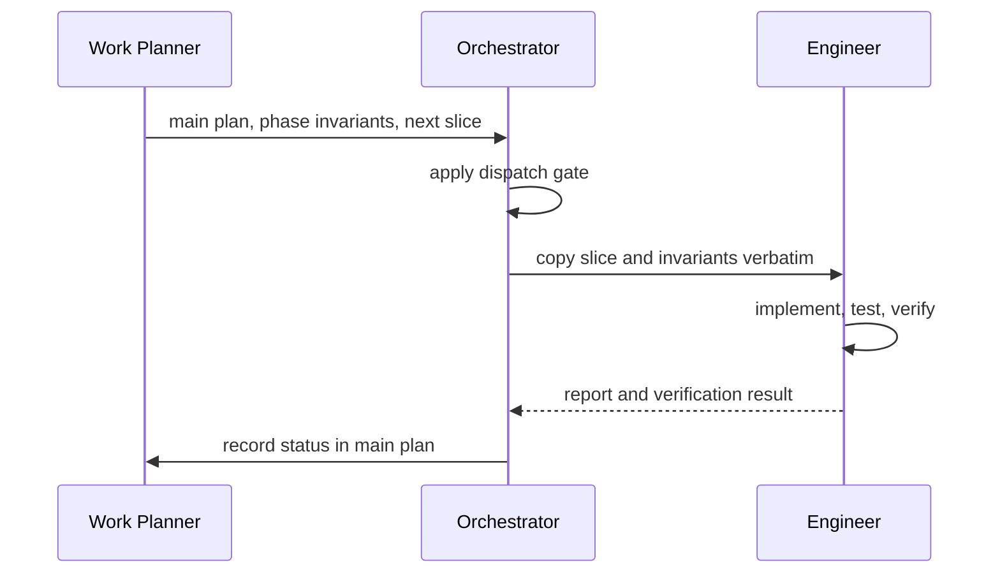

# Agents Catalog

Agents are role-oriented execution modes. Skills define process and artifacts; agents perform or route work under those contracts.

## Brain Storm

Definition: [`.github/agents/brain-storm.agent.md`](../.github/agents/brain-storm.agent.md)

Use `Brain Storm` as the active, interactive agent for a new idea or a change to product truth. It follows the `brain-storm` skill contract and owns only `CONTEXT.md` and `UBIQUITOUS-LANGUAGE.md`.

It interviews the user turn by turn, preserves valid context during amendments, resolves conflicts before writing, and waits for confirmation before updating either artifact. It does not plan, choose target architecture, implement code, or dispatch subagents. When product truth is settled, its VS Code handoff button pre-fills a transition to `PRD Writer`; in the CLI, the user switches to that active agent directly.

## PRD Writer

Definition: [`.github/agents/prd-writer.agent.md`](../.github/agents/prd-writer.agent.md)

Use `PRD Writer` as the active, interactive agent after context is current and confirmed. It follows the `prd-writer` skill contract and owns only `docs/prd/<artifact-slug>-prd.md`.

It settles target behaviors, hard constraints, architecture direction, acceptance signals, and planner-safe assumptions with the user. It redirects changed product truth to `Brain Storm`, applies the ADR gate, and hands a settled PRD to `Work Planner`. Its VS Code handoff button pre-fills that planning transition; in the CLI, the user switches to `Work Planner` directly. It does not inspect implementation maturity, plan work, implement code, or dispatch subagents.

## Work Planner

Definition: [`.github/agents/work-planner.agent.md`](../.github/agents/work-planner.agent.md)

Use `Work Planner` as the active, interactive agent after context and the PRD are current. It follows the `work-planner` skill contract and owns the main plan plus phase and slice artifacts under `docs/plans/`.

It inspects targeted repository evidence to plan the gap to the PRD, asks only planning-level questions, and creates execution-ready slices. It redirects product or target truth changes to `Brain Storm` or `PRD Writer`, respectively; applies the ADR gate to planning decisions; and hands execution-ready work to `Orchestrator`. Its VS Code handoff button pre-fills the request to execute the next approved slice; in the CLI, the user switches to `Orchestrator` directly. It does not implement code or dispatch subagents.

## Orchestrator

Definition: [`.github/agents/orchestrator.agent.md`](../.github/agents/orchestrator.agent.md)

Use `Orchestrator` when an approved implementation plan should move forward. It:

- reads the main plan and active phase detail;
- selects the next slice and applies the dispatch gate;
- marks the slice `in progress` in the main plan;
- dispatches exactly the slice plus phase invariants to `Engineer`;
- confirms that every verification command the slice states was run as written and passed, then records `completed`, or records a blocker;
- advances phase status only after its final integration slice;
- expands the next phase's slices from its approved phase document at a phase boundary, then asks the user to confirm before the first dispatch;
- dispatches small, out-of-plan changes (bug fix, typo, no-op refactor) as an ad hoc brief without touching the plan, when they carry no target-truth change;
- refuses to dispatch and names the redirect (`work-planner`, `prd-writer`, or `brain-storm`) when a request changes target truth, product truth, or is ambiguous between tiers;
- stops and points to `work-planner` when the next phase has no phase document, needs resequencing, or rests on a premise the completed phase invalidated.

Before dispatch, it checks the worktree for changes outside the selected slice. If unrelated or pre-existing changes would contaminate the slice diff, it stops and asks the primary agent or user to commit, isolate, or explicitly reconcile them. A dirty worktree is not permission for Engineer to claim planner, product-truth, instruction, or unrelated implementation files as part of the slice.

It is a router, not a product-code implementer. It may edit only the main plan, an outcome line in a slice document when the completed work deviated from its brief, and the next phase's slice documents during a phase transition.

Its active agent definition must provide `agent` and `execute` tools. `agent` is required to dispatch `Engineer`; `execute` is required to re-run verification when syncing status for work done outside the loop. If either is absent, stop and repair the invocation rather than routing terminal work through `Engineer`.

**Never dispatch `Orchestrator` through a subagent tool (e.g. a one-shot `runSubagent`-style call).** Run it as the active agent mode with full tool parity, including execute/terminal access and the ability to dispatch `Engineer`. It owns verification, so a dispatch path that strips its tool access will silently fail the gate it is responsible for — and, observed in practice, can cause it to write product code directly instead of stopping, which violates its own contract. If `Orchestrator` finds itself missing `agent` or `execute` tools, it must stop and report the invocation problem rather than substitute by doing the work itself.

Its VS Code handoffs are **Clarify product truth**, which moves to `Brain Storm` for a change to the problem, users, workflow, scope, or vocabulary, and **Replan phases or slices**, which moves to `Work Planner` for sequencing, dependency, phase, slice, or status work. Both require user selection and remain available only as guided transitions; neither is automatic. `Orchestrator` still expands an already-approved next phase itself under its Phase Transition rules, so a planning handoff is required only when that phase needs new or revised planning.

## Engineer

Definition: [`.github/agents/engineer.agent.md`](../.github/agents/engineer.agent.md)

Use `Engineer` for an assigned vertical slice. Its brief must include the outcome, scope, verification commands, and acceptance checks. It:

- states assumptions and surfaces ambiguity;
- makes the smallest necessary, surgical change;
- creates or updates tests for the behavior, using the repository's existing test stack rather than a prescribed one;
- runs every stated verification command as written before reporting;
- returns changed files, each command and its result, tradeoffs, and risks in the response — no report files or schemas.

It must not expand scope or guess at unresolved intent. Its default behavior follows Red-Green-Refactor for behavior changes.

`Engineer` does not create commits, establish Git baselines, change hooks, or modify Git history. Those repository-boundary operations belong to the primary agent or user.

## Relationship

The user or an active interactive stage agent selects the next owner. `Orchestrator` should not be used to repair an unsettled PRD or invent missing planning detail.