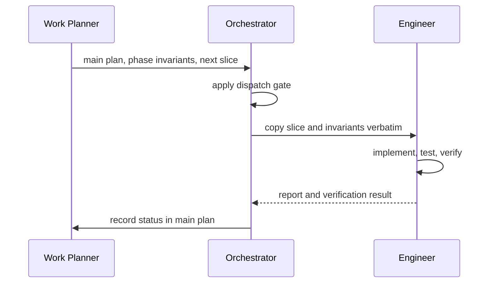

# Agents Catalog

Agents are role-oriented execution modes. Skills define process and artifacts; agents perform or route work under those contracts.

## Orchestrator

Definition: [`.github/agents/orchestrator.agent.md`](../.github/agents/orchestrator.agent.md)

Use `Orchestrator` when an approved implementation plan should move forward. It:

- reads the main plan and active phase detail;
- selects the next slice and applies the dispatch gate;
- marks the slice `in progress` in the main plan;
- dispatches exactly the slice plus phase invariants to `Engineer`;
- confirms verification and records `completed`, or records a blocker;
- advances phase status only after its final integration slice;
- dispatches small, out-of-plan changes (bug fix, typo, no-op refactor) as an ad hoc brief without touching the plan, when they carry no target-truth change;
- refuses to dispatch and names the redirect (`work-planner`, `prd-writer`, or `brain-storm`) when a request changes target truth, product truth, or is ambiguous between tiers;
- stops and points to `work-planner` when the active phase has no next slice.

It is a router, not a product-code implementer. It may edit only the main plan, plus an outcome line in a slice document when the completed work deviated from its brief.

**Never dispatch `Orchestrator` through a subagent tool (e.g. a one-shot `runSubagent`-style call).** Run it as the active agent mode with full tool parity, including execute/terminal access and the ability to dispatch `Engineer`. It owns verification, so a dispatch path that strips its tool access will silently fail the gate it is responsible for — and, observed in practice, can cause it to write product code directly instead of stopping, which violates its own contract. If `Orchestrator` finds itself missing `agent` or `execute` tools, it must stop and report the invocation problem rather than substitute by doing the work itself.

## Engineer

Definition: [`.github/agents/engineer.agent.md`](../.github/agents/engineer.agent.md)

Use `Engineer` for an assigned vertical slice. Its brief must include the outcome, scope, verification command, and acceptance checks. It:

- states assumptions and surfaces ambiguity;
- makes the smallest necessary, surgical change;
- creates or updates tests for the behavior;
- verifies the result before reporting;
- returns changed files, verification, tradeoffs, and risks.

It must not expand scope or guess at unresolved intent. Its default behavior follows Red-Green-Refactor for behavior changes.

## Relationship

The primary agent or user remains responsible for choosing when to run the skills. `Orchestrator` should not be used to repair an unsettled PRD or invent missing planning detail.