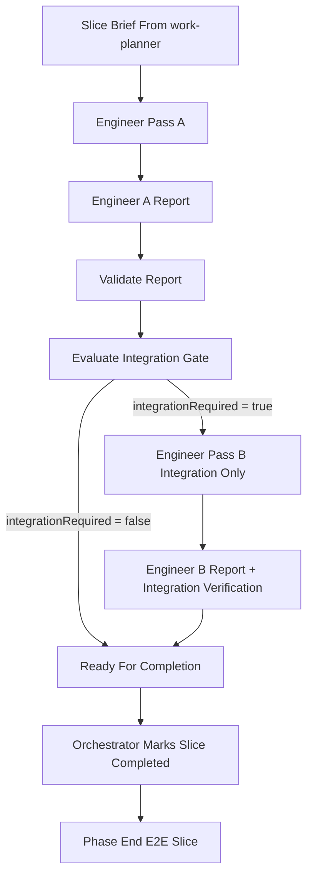

# Deterministic Verification User Guide

This guide is for people using /deterministic-verification during normal engineering work.

It explains:
- what the workflow does
- why it exists
- who is responsible for each part
- what each component does
- how the components work together in real delivery

## What /deterministic-verification Is

/deterministic-verification is a guardrail workflow that makes integration verification predictable around agent-driven implementation.

It does this by combining:
- structured handoff reports
- deterministic gate rules
- script-based checks
- required integration pass when boundaries changed
- phase-end E2E verification

In short:
- Pass A ships behavior and unit tests
- the gate decides if integration coverage is required
- Pass B is integration-only when required
- Orchestrator completes the slice only when required checks are green

## Why It Exists

LLM outputs can vary. This workflow makes completion criteria stable anyway.

It reduces risk by ensuring that:
- boundary-touching changes cannot silently skip integration verification
- report inputs are structured and machine-checkable
- completion is blocked when required artifacts are missing

This protects software quality without forcing integration tests on every slice.

## Who Does What

Primary ownership model:
- work-planner: defines slice scope, verification command, and acceptance checks
- Orchestrator: routes work, runs gate decision process, records status
- Engineer: implements Pass A and Pass B scope, writes reports
- deterministic-verification skill package: owns policies, schemas, templates, scripts, hooks, and make targets

Reference:
- [Ownership Map](../.github/skills/deterministic-verification/OWNERSHIP.md)
- [Skill Contract](../.github/skills/deterministic-verification/SKILL.md)

## End-To-End Flow

## Component Map

Canonical package root:
- [.github/skills/deterministic-verification](../.github/skills/deterministic-verification)

### 1. Policy Components

Purpose:
- human-readable rules that define expected behavior

Files:
- [Testing Split Policy](../.github/skills/deterministic-verification/policies/testing-split-policy.md)
- [Integration Gate Rules](../.github/skills/deterministic-verification/policies/integration-gate-rules.md)
- [Token Budget Policy](../.github/skills/deterministic-verification/policies/token-budget-policy.md)
- [Phase-End E2E Policy](../.github/skills/deterministic-verification/policies/e2e-phase-end-policy.md)

How they are used:
- used by humans and agents as source-of-truth behavior contracts
- reflected by scripts and hook behavior

### 2. Schema Components

Purpose:
- machine-check report shape and required fields

Files:
- [Engineer A Report Schema](../.github/skills/deterministic-verification/schemas/engineer-a-report.schema.json)
- [Engineer B Report Schema](../.github/skills/deterministic-verification/schemas/engineer-b-report.schema.json)

How they are used:
- validate-report script checks report shape and required fields before gate and completion steps

### 3. Template Components

Purpose:
- give Engineer a consistent starting format for reports

Files:
- [Engineer A Report Template](../.github/skills/deterministic-verification/templates/engineer-a-report.template.json)
- [Engineer B Report Template](../.github/skills/deterministic-verification/templates/engineer-b-report.template.json)

How they are used:
- Engineer populates report from template
- Orchestrator and scripts consume predictable fields

### 4. Script Components

Purpose:
- execute deterministic checks and wrappers

Directory:
- [Scripts Directory](../.github/skills/deterministic-verification/scripts)

Important scripts:
- [bootstrap-deterministic-verification.sh](../.github/skills/deterministic-verification/scripts/bootstrap-deterministic-verification.sh): verifies prerequisites and configures hook path
- [validate-report.sh](../.github/skills/deterministic-verification/scripts/validate-report.sh): validates Engineer A/B reports
- [classify-boundaries.sh](../.github/skills/deterministic-verification/scripts/classify-boundaries.sh): classifies changed files into boundary categories
- [evaluate-integration-gate.sh](../.github/skills/deterministic-verification/scripts/evaluate-integration-gate.sh): emits gate JSON including integrationRequired
- [run-unit-verification.sh](../.github/skills/deterministic-verification/scripts/run-unit-verification.sh): executes provided unit verification command
- [run-integration-verification.sh](../.github/skills/deterministic-verification/scripts/run-integration-verification.sh): executes provided integration verification command
- [run-phase-e2e.sh](../.github/skills/deterministic-verification/scripts/run-phase-e2e.sh): executes provided phase E2E command
- [enforce-token-budget.sh](../.github/skills/deterministic-verification/scripts/enforce-token-budget.sh): evaluates payload budget levels

How they are used:
- automation path for gate and verification
- deterministic pass/fail checkpoints

### 5. Hook Components

Purpose:
- enforce local guardrails before commit or push

Directory:
- [Hooks Directory](../.github/skills/deterministic-verification/hooks)

Files:
- [pre-commit](../.github/skills/deterministic-verification/hooks/pre-commit): validates available reports
- [pre-push](../.github/skills/deterministic-verification/hooks/pre-push): validates report + gate outcome + required Pass B report

How they are used:
- catches missing or invalid report states early
- blocks pushing when gate-required artifacts are missing

### 6. Make Targets

Purpose:
- make deterministic workflow commands easy and consistent

File:
- [Deterministic Makefile](../.github/skills/deterministic-verification/Makefile)

Targets:
- deterministic-ready
- setup-hooks
- slice-pass-a
- slice-gate
- slice-pass-b
- phase-e2e

How they are used:
- standard local entrypoints for setup and verification

## Typical Usage Sequence

1. One-time setup per clone

Command:
make -f .github/skills/deterministic-verification/Makefile deterministic-ready

Expected outcome:
- prerequisite check passes
- git hooks path set to .github skill hooks

2. Execute Pass A verification

Command shape:
make -f .github/skills/deterministic-verification/Makefile slice-pass-a SLICE=<slice-path> COMMAND="<unit-command>"

3. Evaluate gate decision

Command shape:
make -f .github/skills/deterministic-verification/Makefile slice-gate REPORT=out/engineer-a-report.json

The gate derives changed files from Git. A commit is not required, but the report's `changedFiles` must match the staged, unstaged, and untracked files in the current change set, excluding the report itself.

4. If gate requires integration, execute Pass B verification

Command shape:
make -f .github/skills/deterministic-verification/Makefile slice-pass-b SLICE=<slice-path> COMMAND="<integration-command>"

5. At phase end, run E2E

Command shape:
make -f .github/skills/deterministic-verification/Makefile phase-e2e PHASE=<phase-path> COMMAND="<e2e-command>"

## Gate Output And Meaning

The gate emits JSON with:
- sliceId
- integrationRequired
- reasons
- targets

Interpretation:
- integrationRequired false: no Pass B required for this slice
- integrationRequired true: Pass B required before completion

## What This Improves In Software Engineering

Quality and risk control:
- boundary-sensitive changes get the right depth of testing
- release confidence increases through explicit integration and phase-end E2E checks

Team consistency:
- clear handoff contracts between planning, orchestration, and engineering
- fewer ad hoc interpretations of done-state

Scalability:
- deterministic process scales better across contributors and sessions
- easier onboarding due to explicit rules and repeatable commands

## Troubleshooting

Bootstrap fails with jq error:
- install jq
- rerun deterministic-ready

Gate says Pass B required but no Engineer B report exists:
- produce out/engineer-b-report.json
- validate again

Gate says the report changed files do not match Git:
- the slice may be uncommitted; commit or isolate completed/unrelated work and rerun
- for an orchestrated baseline, rerun with `--diff-base <baseline>`
- if several slices intentionally form one scope, reconcile `changedFiles` to the combined set and rerun
- do not rerun Engineer A unless the gate reports a behavior or verification failure

Verification script says command is missing:
- supply COMMAND in make target
- or set UNIT_TEST_COMMAND / INTEGRATION_TEST_COMMAND / E2E_COMMAND as required

## Related References

- [Deterministic Verification Skill Contract](../.github/skills/deterministic-verification/SKILL.md)
- [Deterministic Ownership](../.github/skills/deterministic-verification/OWNERSHIP.md)